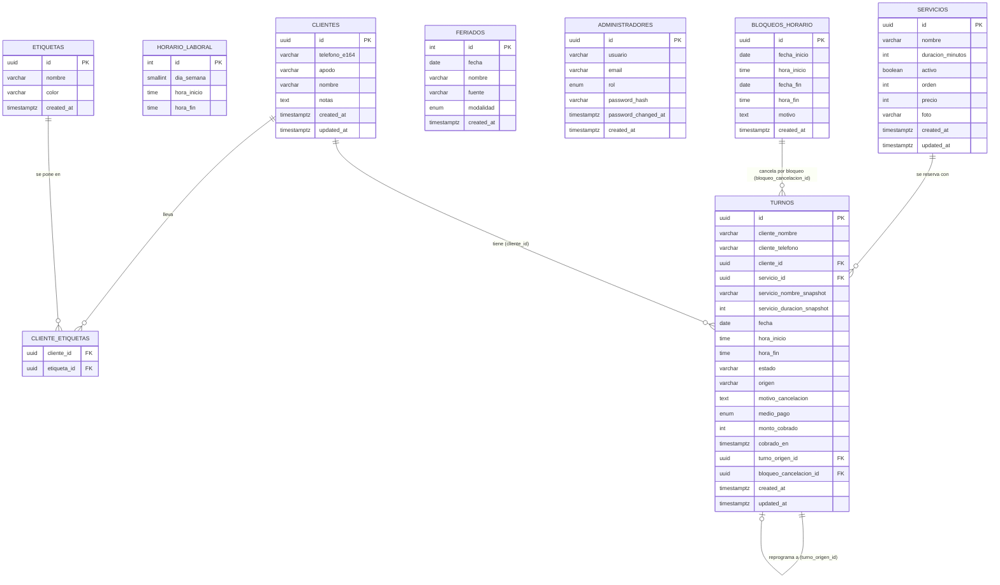

# Modelo de Datos / ERD
### Turnero — La Peluquería de Ariel Enrique

---

## 1. Diagrama entidad-relación

`HORARIO_LABORAL`, `FERIADOS` y `ADMINISTRADORES` no tienen relación por fila con `TURNOS`:
las dos primeras son tablas de configuración que alimentan el cálculo de disponibilidad
(CU-04), y `ADMINISTRADORES` es solo para el login de Ariel (HU-15).

---

## 2. Tablas

### `servicios` — HU-13

| Columna | Tipo | Notas |
|---|---|---|
| `id` | uuid, PK | |
| `nombre` | varchar, not null | |
| `duracion_minutos` | int, not null | |
| `activo` | boolean, default true | Desactivar sin borrar — no puede desaparecer un servicio que ya tiene turnos históricos asociados |
| `orden` | int, default 0 | Posición en la que se le muestran al cliente, del más pedido al menos. Es un dato propio porque no se deduce de ningún otro: el orden que quiere Ariel (Corte clásico, Corte + Barba, Barba, Corte de Pelo mujer) no coincide ni con el alfabético ni con la duración. Menor va primero, y el nombre desempata para que dos servicios con el mismo valor no queden en un orden que cambie entre consultas. Un servicio nuevo se crea con el máximo + 1, o sea al final |
| `precio` | int, **null** | Cuánto sale, en **pesos enteros** (HU-27). ⚠️ **Sale por la API pública desde el 14/8/2026** — hasta esa fecha era un dato interno; ver abajo. `null` = todavía no le puso precio, que no es lo mismo que `0` |
| `foto` | varchar, **null** | La foto que ve el cliente en la landing (`/imagenes/servicio-corte.jpg`). `null` = cae a una foto de stock. Igual que `precio`, sale por la API pública: es lo que se dibuja del lado del cliente |
| `created_at` / `updated_at` | timestamptz | |

⚠️ **`foto` es una columna y no un mapa `nombre → archivo` en el frontend**, que es como
estaba hasta la v3. El nombre del servicio es un campo que Ariel edita desde el panel
(HU-13): renombrar "Corte clásico" le borraba la foto **en silencio** —la pantalla no
fallaba, simplemente pasaba a mostrar una de stock y nada lo avisaba—. Atada a la fila, el
nombre puede cambiar todas las veces que quiera. Es el mismo error que el proyecto ya había
evitado en HU-25 al no usar el nombre del cliente como identidad.

La migración `foto_de_servicio` traspasó ese mapeo a la base **una única vez**, matcheando
por nombre. De ahí en más el vínculo es la fila. Ariel no elige la foto desde el panel: se
asigna en la base o en una migración, que es donde también se le pone a un servicio nuevo.

**Los montos son enteros en pesos, no decimales.** Ariel no cobra centavos, así que un
`numeric(10,2)` agregaría una precisión que ningún dato usa; con enteros no hay redondeo
de punto flotante en ninguna suma. Vale para `servicios.precio` y para
`turnos.monto_cobrado`.

⚠️ **El precio sí sale por la API pública desde el 14/8/2026**, y eso **enmienda a HU-27**,
que hasta esa fecha decía que era interno y que el cliente no lo veía nunca. Franco lo
cambió: quiere que sepa cuánto sale antes de reservar. Sale por `GET /api/servicios` y,
dentro de `servicio`, por `GET /api/turnos/:id`.

Lo que **sigue sin salir** es el cobro (`turnos.medio_pago`, `turnos.monto_cobrado`). Y el
mapeo campo por campo de `getServiciosPublico` se conserva igual de explícito: no era una
promesa sobre `precio` en particular, sino el mecanismo que obliga a decidir dato por dato
qué se publica. Devolver la fila entera o reusar el DTO de admin publicaría cualquier
columna interna futura sin que nada falle ni lo avise.

⚠️ **El precio que ve el cliente es el de hoy, no el del día en que reservó.** Al revés que
`servicio_nombre_snapshot` y `servicio_duracion_snapshot`, que sí quedan congelados. No es
una incoherencia: la duración se congela porque decide la disponibilidad, y el precio que
importa es el que se le va a cobrar cuando venga — la misma regla que `monto_cobrado`.

### `horario_laboral` — HU-14, CU-04

| Columna | Tipo | Notas |
|---|---|---|
| `id` | serial, PK | |
| `dia_semana` | smallint, not null | 0 = domingo … 6 = sábado |
| `hora_inicio` | time, not null | |
| `hora_fin` | time, not null | |

Una fila por franja horaria. Ejemplo de carga inicial según el horario real de Ariel:

| dia_semana | hora_inicio | hora_fin |
|---|---|---|
| martes (2) | 10:00 | 13:00 |
| martes (2) | 17:00 | 20:00 |
| miércoles (3) | 10:00 | 13:00 |
| miércoles (3) | 17:00 | 20:00 |
| jueves (4) | 10:00 | 13:00 |
| jueves (4) | 17:00 | 20:00 |
| viernes (5) | 10:00 | 13:00 |
| viernes (5) | 17:00 | 20:00 |
| sábado (6) | 10:00 | 13:00 |
| sábado (6) | 17:00 | 20:30 |

Domingo y lunes no tienen filas → el local está cerrado esos días. Si Ariel cambia sus
horarios desde el panel (HU-14), esta tabla es la que se edita; los turnos ya reservados
no se recalculan retroactivamente (ver caso borde correspondiente en el documento de
requisitos).

### `bloqueos_horario` — HU-11, CU-03

| Columna | Tipo | Notas |
|---|---|---|
| `id` | uuid, PK | |
| `fecha_inicio` | date, not null | |
| `hora_inicio` | time, null | `null` = desde el inicio del horario laboral de ese día |
| `fecha_fin` | date, not null | |
| `hora_fin` | time, null | `null` = hasta el cierre del horario laboral de ese día |
| `motivo` | text | ej. "almuerzo largo", "vacaciones" |
| `created_at` | timestamptz | |

Un mismo diseño cubre los dos casos que necesita Ariel: bloquear una tarde puntual
(`fecha_inicio = fecha_fin`, horas puntuales) y bloquear varios días seguidos como unas
vacaciones (rango de fechas, horas en `null` = día completo).

### `feriados`

| Columna | Tipo | Notas |
|---|---|---|
| `id` | serial, PK | |
| `fecha` | date, unique, not null | |
| `nombre` | varchar | ej. "Día de la Independencia" |
| `fuente` | varchar | de dónde se importó (para trazabilidad del sync) |
| `modalidad` | enum (`cerrado`, `medio_dia`, `dia_completo`), default `medio_dia` | Qué hace Ariel ese día (HU-24). El default **no** es cerrar: en un feriado atiende medio día, y cerrar sería inventarle una decisión que no tomó |
| `created_at` | timestamptz | |

Se sincroniza desde **Nager.Date** (`date.nager.at`, gratuita y sin credenciales), que
devuelve el nombre en español. A efectos del cálculo de disponibilidad:

- `cerrado` — se trata igual que un bloqueo de día completo.
- `dia_completo` — el día se calcula con el `horario_laboral` normal, como si no fuera feriado.
- `medio_dia` — se recorta a la **primera franja** del día. Se dice "primera franja" y no
  "la mañana" a propósito: sale de `horario_laboral`, así que si Ariel cambia sus horarios
  la regla lo sigue sola.

⚠️ **La sincronización nunca toca `modalidad`.** Es la única columna que refleja una
decisión de Ariel: un `upsert` que reescriba la fila entera se la borra sin avisar. El
`update` se limita a `nombre` y `fuente`; el default solo actúa al crear. Tampoco se borran
los feriados que dejan de venir de la fuente, por el mismo motivo.

Un feriado solo tiene efecto en los días que Ariel trabaja: si `horario_laboral` no tiene
franjas para ese día de la semana, el día ya estaba cerrado y la modalidad no cambia nada.

### `clientes` — HU-25

La ficha de una persona. **La identidad es el teléfono normalizado, no el nombre**, y esa
es la única decisión de fondo de la tabla: el nombre que tipea el cliente cambia de una
reserva a la otra ("Juan", "juan perez", "Juan P."), y adivinar que esos tres son la misma
persona es exactamente el tipo de heurística que se equivoca en silencio y une a dos
clientes distintos. El número, una vez traducido a E.164, es el mismo.

| Columna | Tipo | Notas |
|---|---|---|
| `id` | uuid, PK | |
| `telefono_e164` | varchar, **unique**, not null | E.164 sin el `+` (`5493514593325`), tal como lo devuelve `utils/telefono.ts`. La unicidad es lo que hace que la ficha se encuentre sola en la segunda reserva, sin que Ariel una nada a mano |
| `apodo` | varchar, null | El nombre que le pone Ariel: en su planilla usa "Flaco", "Jubilado bici", "Roja". Cuando está, manda sobre `nombre` en toda la interfaz |
| `nombre` | varchar, not null | Cómo se presentó la última vez que reservó. Se pisa en cada turno nuevo a propósito: es con el que se identifica hoy, no un histórico |
| `notas` | text, null | Observaciones de Ariel sobre esa persona. Es lo que hace que esto sea una ficha y no un contador de visitas |
| `created_at` / `updated_at` | timestamptz | |

**El teléfono se guarda normalizado acá y sin normalizar en `turnos`, y las dos cosas son
correctas.** `turnos.cliente_telefono` es la copia de lo que escribió la persona, porque
Ariel lo lee para llamar — el mismo criterio que el snapshot del servicio.
`clientes.telefono_e164` es la forma canónica, porque una identidad tiene que ser
comparable. Son dos usos distintos del mismo dato, no una duplicación.

### `etiquetas` y `cliente_etiquetas` — HU-25

Las insignias que Ariel se arma solo: un círculo de color más el texto que él escriba.

| Columna | Tipo | Notas |
|---|---|---|
| `id` | uuid, PK | |
| `nombre` | varchar, unique, not null | Lo escribe Ariel: "Suele cancelar", "VIP", "Paga con Mercado Pago" |
| `color` | varchar, not null | Hexadecimal `#rrggbb`. Lo elige libremente: la insignia es un círculo pleno y no texto sobre un fondo de color, así que ningún valor la vuelve ilegible. La interfaz le dibuja un anillo del color del texto para que un color oscuro se recorte sobre el tema oscuro y uno claro sobre el claro |
| `clave` | varchar, unique, **null** | Identidad estable de las etiquetas que pone el sistema solo. Hoy hay una: `cliente_nuevo`. `null` en las que crea Ariel |
| `created_at` | timestamptz | |

**Por qué `clave` y no buscar por nombre.** La etiqueta "Nuevo" se la pone el sistema a
toda ficha recién creada, y Ariel puede renombrarla a "Primera vez" y cambiarle el color
cuando quiera. Si el automatismo la buscara por el nombre, renombrarla lo rompería en
silencio: los clientes nuevos dejarían de marcarse y nada lo diría. La `clave` separa **qué
etiqueta es** de **cómo se llama**.

Si Ariel la borra, los clientes nuevos dejan de marcarse y todo lo demás sigue igual — el
alta de un turno nunca falla por esto. La pantalla de etiquetas marca cuál es la
automática, para que borrarla sea una decisión y no un accidente.

`cliente_etiquetas` es la tabla de unión (PK compuesta `cliente_id` + `etiqueta_id`, las
dos FK con `ON DELETE CASCADE`). Es muchos a muchos porque un cliente puede ser "VIP" y
"Suele cancelar" a la vez.

**Acá sí se borra de verdad, a diferencia de `servicios`.** Un servicio no se puede borrar
porque hay turnos históricos que lo referencian y quedarían sin significado; una insignia
solo describe cómo ve Ariel a un cliente hoy, y si deja de usarla no queda ningún registro
incompleto atrás.

### `administradores` — HU-15, HU-16

| Columna | Tipo | Notas |
|---|---|---|
| `id` | uuid, PK | |
| `usuario` | varchar, unique, not null | **El nombre que se muestra**, no la credencial. Dejó de serlo en HU-26 |
| `email` | varchar, unique, **null** | Con lo que se entra (HU-26), y a dónde va el link de "me olvidé la contraseña". Nullable en el esquema y obligatorio en la práctica: una fila sin email no puede loguearse. Es nullable porque la columna se agregó sobre una base que ya tenía una cuenta creada, y ponerle un email inventado para satisfacer un `NOT NULL` habría sido escribir un dato falso en la única fila que importaba |
| `rol` | enum (`super_admin`, `admin`), default `admin` | Qué puede hacer (HU-26). El default es el rol restringido: una cuenta nueva no nace pudiendo administrar cuentas |
| `password_hash` | varchar, not null | nunca se guarda la contraseña en texto plano (bcrypt) |
| `password_changed_at` | timestamptz, null | último cambio de contraseña (HU-16); `null` = nunca se cambió |
| `created_at` | timestamptz | |

Se modela como tabla en vez de credenciales fijas por variable de entorno, para no tener
que tocar código si cambia la contraseña o se agrega otra cuenta. Eso es exactamente lo
que habilitó HU-16 primero y HU-26 después: las variables de entorno solo se leen en el
seed inicial para crear las filas, y desde ahí todo se administra desde el panel.

**Los dos roles, y por qué la diferencia es tan chica.** Todo lo que hace el panel *es*
gestionar la peluquería, así que lo único que se puede restringir de verdad es la
**administración de cuentas**: ver quiénes hay, crear una y fijarle la contraseña a otro.
`super_admin` puede eso; `admin` puede todo lo demás. No hay una tercera cosa escondida, y
decirlo explícito evita que alguien busque una.

`email` es único y se guarda en minúsculas: las direcciones no distinguen mayúsculas en la
práctica y nadie tipea su mail igual dos veces.

**El token de "me olvidé la contraseña" no tiene tabla.** Es un JWT firmado con el secreto
global **más el `password_hash` actual de esa cuenta**. De ahí sale que valga un solo uso:
al restablecer, el hash cambia, y el token viejo —firmado con el anterior— deja de
verificar. Sin tabla de tokens, sin job que limpie los vencidos y sin estado que se pueda
desincronizar. Vence a los 30 minutos, porque es algo que viaja por mail y queda en la
bandeja de entrada para siempre.

`password_changed_at` es lo que hace que cambiar la contraseña cierre de verdad las otras
sesiones: el middleware de auth rechaza todo JWT cuyo `iat` sea anterior a esta fecha.
Es la única consulta a base que hace la validación del token, y rompe a propósito la
pureza "stateless" del JWT — sin ella, un token robado seguiría valiendo hasta 7 días
después de cambiar la contraseña, y la funcionalidad daría una sensación falsa de
seguridad.

### `turnos` — HU-01 a HU-10, CU-01, CU-02, CU-04, casos borde

| Columna | Tipo | Notas |
|---|---|---|
| `id` | uuid, PK, default `gen_random_uuid()` | Se usa directamente como **token del link único** que recibe el cliente — no adivinable, sin necesidad de un campo separado |
| `cliente_nombre` | varchar, not null | |
| `cliente_telefono` | varchar, **null** | Obligatorio cuando reserva el cliente por la web (HU-01) y opcional cuando el turno lo carga Ariel (HU-08). La diferencia la impone la validación de cada endpoint, no la columna: no hay forma de expresar "obligatorio según quién lo cree" en el esquema. Si viene, tiene que estar bien escrito **y** poder existir (característica real) — desde el 14/8/2026 las dos reglas corren en las tres puertas, ver HU-01 |
| `cliente_email` | varchar, null | Opcional (HU-19): muchos clientes de Ariel no usan mail. Si está, recibe la confirmación con el link y el `.ics` |
| `cliente_id` | uuid, null, FK → `clientes.id` | La ficha a la que pertenece el turno (HU-25). `null` cuando no hay teléfono: sin número no hay identidad, y una ficha vacía por cada turno suelto sería peor que no tenerla. **No reemplaza a `cliente_nombre`/`cliente_telefono`**, que siguen siendo la copia de lo que se escribió al reservar |
| `servicio_id` | uuid, FK → `servicios.id`, not null | |
| `servicio_nombre_snapshot` | varchar, not null | "Foto" del servicio al momento de reservar |
| `servicio_duracion_snapshot` | int, not null | Ídem, en minutos |
| `fecha` | date, not null | |
| `hora_inicio` | time, not null | |
| `hora_fin` | time, not null | Calculada (`hora_inicio` + duración snapshot) y guardada, para usarla directo en el constraint anti-solapamiento |
| `estado` | varchar, `CHECK` | `reservado` \| `cancelado` \| `reprogramado` \| `realizado` \| `ausente` |
| `origen` | enum `OrigenTurno` | `online` \| `presencial` \| `llamada` \| `whatsapp` (HU-08). `presencial` es el cliente de vidriera, que no llamó ni escribió; `llamada` se llamaba `telefono` hasta el 14/8/2026 y se renombró porque se confundía con `cliente_telefono`, que es un dato de contacto y no un canal. La migración usó `ALTER TYPE … RENAME VALUE`, así que las filas viejas se conservaron |
| `visto_por_admin` | boolean, not null, default `false` | HU-17: si Ariel ya vio el turno en el panel. Los que carga él mismo nacen en `true` |
| `motivo_cancelacion` | text, null | |
| `medio_pago` | enum (`efectivo`, `transferencia`, `mercado_pago`, `tarjeta`), **null** | Cómo pagó (HU-27). `null` = todavía no se registró el cobro |
| `monto_cobrado` | int, **null** | Cuánto pagó, en **pesos enteros**. Ver abajo por qué no es un snapshot |
| `cobrado_en` | timestamptz, **null** | Cuándo se registró el cobro |
| `turno_origen_id` | uuid, null, FK → `turnos.id` | Si nació de una reprogramación, apunta al turno viejo (HU-04) |
| `bloqueo_cancelacion_id` | uuid, null, FK → `bloqueos_horario.id` | Si fue cancelado porque Ariel bloqueó ese rango (CU-03), queda registrado el motivo puntual |
| `created_at` / `updated_at` | timestamptz | |

**Los tres campos del cobro van juntos (HU-27):** o están los tres o no está ninguno.
`null` en los tres significa "todavía no se registró el cobro", que es un estado legítimo
—Ariel puede marcar Realizado y cargarlo después, igual que el teléfono en HU-25— y es el
estado en el que quedan todos los turnos anteriores a esta etapa. **No hay backfill:**
inventarles un medio de pago sería escribir un dato falso, el mismo criterio con el que el
seed no le pisa la contraseña a una cuenta que ya existe.

**Columnas acá y no una tabla `pagos`.** Hay un pago por turno, sin pagos parciales ni
historial de cobros. Una tabla aparte sería estado que se puede desincronizar del turno
para conseguir exactamente lo mismo — el mismo criterio con el que el token de reset de
HU-26 no tiene tabla. Registrar dos veces es corregir, no duplicar.

⚠️ **`monto_cobrado` NO es un snapshot del precio al reservar**, a diferencia de
`servicio_duracion_snapshot`, y la diferencia es deliberada. La duración se congela porque
decide la disponibilidad: cambiarla movería turnos ya agendados. El precio no afecta nada
hasta que se cobra, y con la inflación un turno reservado hace tres semanas se cobra al
precio de hoy — que es lo que Ariel efectivamente cobra. El monto se copia del precio del
servicio **en el momento de cobrar** y él lo puede pisar (descuento, jubilado), que es la
otra mitad de por qué se guarda el número y no una referencia al servicio.

---

### `push_suscripciones` — HU-18

Una fila por dispositivo con los avisos activados. Ariel usa dos celulares y una
computadora, así que son varias a la vez.

**Sin FK a `administradores`, a propósito.** Hay un solo administrador; agregar la
relación "por las dudas" sería generalidad especulativa. Si algún día hay empleados, se
agrega en esa misma etapa.

| Columna | Tipo | Notas |
|---|---|---|
| `id` | uuid, PK, default `gen_random_uuid()` | |
| `endpoint` | text, not null, **unique** | La URL que da el navegador para empujarle una notificación. La unicidad es lo que hace idempotente el alta: si el mismo dispositivo se vuelve a suscribir, se actualiza en vez de duplicarse |
| `p256dh` | text, not null | Clave pública del navegador, para cifrar el mensaje |
| `auth` | text, not null | Secreto de autenticación del navegador |
| `user_agent` | text, null | Para saber **cuál** de los dispositivos de Ariel es cada fila. Sin esto, "avisos activados en 3 dispositivos" no ayuda a diagnosticar cuando uno deja de andar |
| `ultimo_intento_en` | timestamptz, null | Cuándo se intentó enviar por última vez |
| `ultimo_estado` | int, null | Código HTTP que devolvió el servicio de push. **201 = aceptado, no entregado**: el servicio toma el mensaje y después decide si el dispositivo lo recibe. Es el techo de lo que el servidor puede saber |
| `ultimo_error` | text, null | Mensaje del último fallo, si hubo |
| `created_at` / `updated_at` | timestamptz | |

Los códigos **404 y 410** significan que la suscripción ya no existe (se desinstaló la
aplicación, se revocó el permiso). Ante ellos la fila se borra: si no, se acumulan
suscripciones muertas para siempre. Un **401 o 403** es distinto — casi siempre significa
que las claves VAPID del servidor no son las que firmaron esa suscripción, típicamente
después de rotarlas; esa fila se conserva y hay que volver a activar los avisos en el
dispositivo.

---

## 3. Reglas de integridad clave

| Regla | Cómo se implementa |
|---|---|
| Dos clientes no pueden reservar el mismo horario (caso borde) | `EXCLUDE` constraint de PostgreSQL sobre `tsrange(fecha + hora_inicio, fecha + hora_fin)`, activo `WHERE estado IN ('reservado','realizado')`. Lo impone la base de datos, no solo la aplicación |
| Un turno **realizado** no se puede pisar (14/8/2026) | Mismo `EXCLUDE` de arriba: `realizado` entró al predicado. Antes solo miraba `reservado`, y eso era inofensivo mientras nadie pudiera cargar un turno en el pasado; con HU-08 ampliada pasó a ser un agujero alcanzable. La misma lista vive en el cálculo de disponibilidad (`obtenerDetalleDelDia`), así que la aplicación no ofrece esos ratos y la base los rechaza igual. ⚠️ Consecuencia: marcar Realizado puede fallar con `409 TURNO_SE_SOLAPA_CON_REALIZADO` |
| Un turno **ausente o cancelado** libera el rato | Los dos quedan **afuera** del predicado del `EXCLUDE`, a propósito. Marcar Ausente para meter a otro cliente es el flujo que Ariel usa todos los días: endurecerlo a los tres estados que la agenda dibuja rompería justo eso |
| Servicio largo que no entra antes del cierre/descanso (caso borde) | Se valida en el cálculo de disponibilidad del backend (CU-04); no es una constraint de tabla, depende de `horario_laboral` y `bloqueos_horario` vigentes en el momento de la consulta |
| Cambio de duración de un servicio no afecta turnos ya reservados (caso borde) | Columnas `servicio_nombre_snapshot` / `servicio_duracion_snapshot` en `turnos`, independientes de `servicios` |
| Un turno nunca se borra físicamente | La aplicación nunca hace `DELETE` sobre `turnos`; todo cambio es un `UPDATE` de `estado` (+ `updated_at`) |
| Cliente pierde su link único (caso borde) | Ariel puede buscar el turno en el panel por nombre/teléfono/fecha y reconstruir el link a partir del `id` (no hace falta mecanismo de recuperación aparte) |

---

## 4. Supuestos y puntos abiertos

1. **Fuente de feriados.** Este documento define solo la tabla `feriados`; de qué
   API/librería concreta se importan y con qué frecuencia se sincroniza se decide en la
   etapa de especificación de la API/backend.

---

## 5. Fuera de alcance de este documento

Migraciones SQL reales, ORM/query builder, y detalle de índices de performance — eso se
define en la etapa de desarrollo, una vez validado este modelo.

---

**Siguiente etapa:** Especificación de la API REST (endpoints, contratos de request/response).
