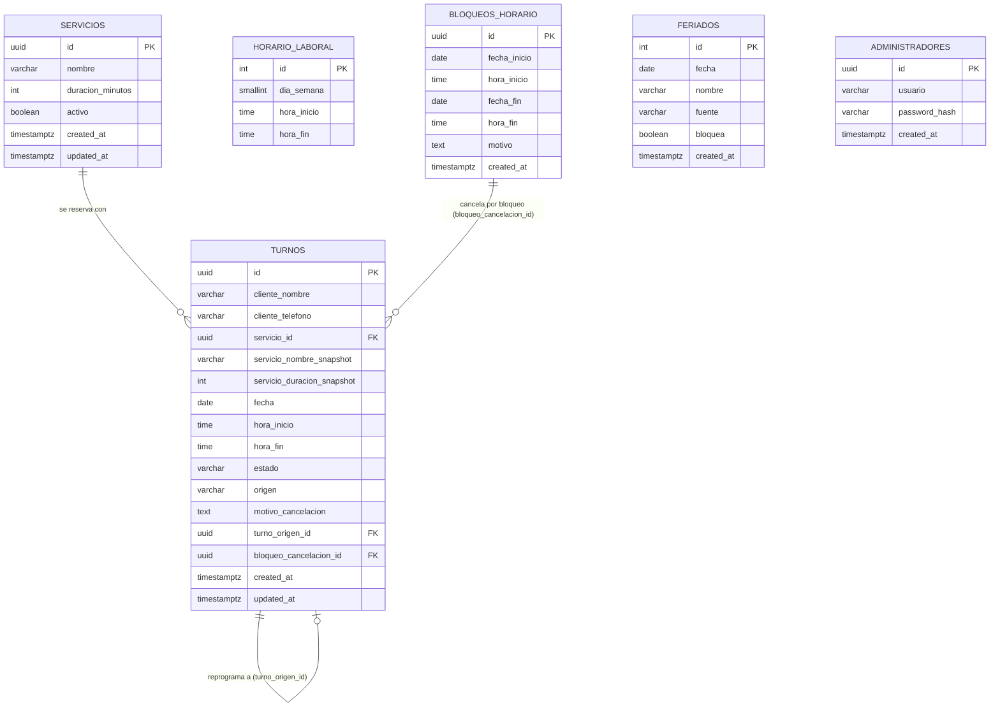

# Modelo de Datos / ERD
### Turnero — La Peluquería de Ariel Enrique | v1

---

## 1. Diagrama entidad-relación

`HORARIO_LABORAL`, `FERIADOS` y `ADMINISTRADORES` no tienen relación por fila con `TURNOS`:
las dos primeras son tablas de configuración que alimentan el cálculo de disponibilidad
(CU-04), y `ADMINISTRADORES` es solo para el login de Ariel (HU-15).

---

## 2. Tablas

### `servicios` — HU-13

| Columna | Tipo | Notas |
|---|---|---|
| `id` | uuid, PK | |
| `nombre` | varchar, not null | |
| `duracion_minutos` | int, not null | |
| `activo` | boolean, default true | Desactivar sin borrar — no puede desaparecer un servicio que ya tiene turnos históricos asociados |
| `orden` | int, default 0 | Posición en la que se le muestran al cliente, del más pedido al menos. Es un dato propio porque no se deduce de ningún otro: el orden que quiere Ariel (Corte clásico, Corte + Barba, Barba, Color) no coincide ni con el alfabético ni con la duración. Menor va primero, y el nombre desempata para que dos servicios con el mismo valor no queden en un orden que cambie entre consultas. Un servicio nuevo se crea con el máximo + 1, o sea al final |
| `created_at` / `updated_at` | timestamptz | |

### `horario_laboral` — HU-14, CU-04

| Columna | Tipo | Notas |
|---|---|---|
| `id` | serial, PK | |
| `dia_semana` | smallint, not null | 0 = domingo … 6 = sábado |
| `hora_inicio` | time, not null | |
| `hora_fin` | time, not null | |

Una fila por franja horaria. Ejemplo de carga inicial según el horario real de Ariel:

| dia_semana | hora_inicio | hora_fin |
|---|---|---|
| martes (2) | 10:00 | 13:00 |
| martes (2) | 17:00 | 20:00 |
| miércoles (3) | 10:00 | 13:00 |
| miércoles (3) | 17:00 | 20:00 |
| jueves (4) | 10:00 | 13:00 |
| jueves (4) | 17:00 | 20:00 |
| viernes (5) | 10:00 | 13:00 |
| viernes (5) | 17:00 | 20:00 |
| sábado (6) | 10:00 | 13:00 |
| sábado (6) | 17:00 | 20:30 |

Domingo y lunes no tienen filas → el local está cerrado esos días. Si Ariel cambia sus
horarios desde el panel (HU-14), esta tabla es la que se edita; los turnos ya reservados
no se recalculan retroactivamente (ver caso borde correspondiente en el documento de
requisitos).

### `bloqueos_horario` — HU-11, CU-03

| Columna | Tipo | Notas |
|---|---|---|
| `id` | uuid, PK | |
| `fecha_inicio` | date, not null | |
| `hora_inicio` | time, null | `null` = desde el inicio del horario laboral de ese día |
| `fecha_fin` | date, not null | |
| `hora_fin` | time, null | `null` = hasta el cierre del horario laboral de ese día |
| `motivo` | text | ej. "almuerzo largo", "vacaciones" |
| `created_at` | timestamptz | |

Un mismo diseño cubre los dos casos que necesita Ariel: bloquear una tarde puntual
(`fecha_inicio = fecha_fin`, horas puntuales) y bloquear varios días seguidos como unas
vacaciones (rango de fechas, horas en `null` = día completo).

### `feriados`

| Columna | Tipo | Notas |
|---|---|---|
| `id` | serial, PK | |
| `fecha` | date, unique, not null | |
| `nombre` | varchar | ej. "Día de la Independencia" |
| `fuente` | varchar | de dónde se importó (para trazabilidad del sync) |
| `bloquea` | boolean, default true | Si es `true`, ese día no se ofrece disponibilidad (comportamiento por defecto al importar el feriado). Ariel puede "destaparlo" desde el panel poniéndolo en `false` si decide atender igual, sin borrar el registro del feriado |
| `created_at` | timestamptz | |

Se sincroniza desde una fuente externa de feriados de Argentina (la integración concreta
se define en la etapa de backend, no en este documento). A efectos del cálculo de
disponibilidad, un feriado con `bloquea = true` se trata igual que un bloqueo de día
completo; con `bloquea = false` el día se calcula con el `horario_laboral` normal, como si
no fuera feriado.

### `administradores` — HU-15, HU-16

| Columna | Tipo | Notas |
|---|---|---|
| `id` | uuid, PK | |
| `usuario` | varchar, unique, not null | |
| `password_hash` | varchar, not null | nunca se guarda la contraseña en texto plano (bcrypt) |
| `password_changed_at` | timestamptz, null | último cambio de contraseña (HU-16); `null` = nunca se cambió |
| `created_at` | timestamptz | |

Aunque hoy hay un solo administrador (Ariel), se modela como tabla en vez de credenciales
fijas por variable de entorno, para no tener que tocar código si el día de mañana cambia
la contraseña o se agrega un segundo usuario administrativo. Eso es exactamente lo que
habilitó HU-16: la variable de entorno `ADMIN_PASSWORD` solo se lee en el seed inicial
para crear la fila, y desde ahí la contraseña se administra desde el panel.

`password_changed_at` es lo que hace que cambiar la contraseña cierre de verdad las otras
sesiones: el middleware de auth rechaza todo JWT cuyo `iat` sea anterior a esta fecha.
Es la única consulta a base que hace la validación del token, y rompe a propósito la
pureza "stateless" del JWT — sin ella, un token robado seguiría valiendo hasta 7 días
después de cambiar la contraseña, y la funcionalidad daría una sensación falsa de
seguridad.

### `turnos` — HU-01 a HU-10, CU-01, CU-02, CU-04, casos borde

| Columna | Tipo | Notas |
|---|---|---|
| `id` | uuid, PK, default `gen_random_uuid()` | Se usa directamente como **token del link único** que recibe el cliente — no adivinable, sin necesidad de un campo separado |
| `cliente_nombre` | varchar, not null | |
| `cliente_telefono` | varchar, not null | |
| `cliente_email` | varchar, null | Opcional (HU-19): muchos clientes de Ariel no usan mail. Si está, recibe la confirmación con el link y el `.ics` |
| `servicio_id` | uuid, FK → `servicios.id`, not null | |
| `servicio_nombre_snapshot` | varchar, not null | "Foto" del servicio al momento de reservar |
| `servicio_duracion_snapshot` | int, not null | Ídem, en minutos |
| `fecha` | date, not null | |
| `hora_inicio` | time, not null | |
| `hora_fin` | time, not null | Calculada (`hora_inicio` + duración snapshot) y guardada, para usarla directo en el constraint anti-solapamiento |
| `estado` | varchar, `CHECK` | `reservado` \| `cancelado` \| `reprogramado` \| `realizado` \| `ausente` |
| `origen` | varchar, `CHECK` | `online` \| `telefono` \| `whatsapp` (HU-08) |
| `visto_por_admin` | boolean, not null, default `false` | HU-17: si Ariel ya vio el turno en el panel. Los que carga él mismo nacen en `true` |
| `motivo_cancelacion` | text, null | |
| `turno_origen_id` | uuid, null, FK → `turnos.id` | Si nació de una reprogramación, apunta al turno viejo (HU-04) |
| `bloqueo_cancelacion_id` | uuid, null, FK → `bloqueos_horario.id` | Si fue cancelado porque Ariel bloqueó ese rango (CU-03), queda registrado el motivo puntual |
| `created_at` / `updated_at` | timestamptz | |

---

## 3. Reglas de integridad clave

| Regla | Cómo se implementa |
|---|---|
| Dos clientes no pueden reservar el mismo horario (caso borde) | `EXCLUDE` constraint de PostgreSQL sobre `tsrange(fecha + hora_inicio, fecha + hora_fin)`, activo solo `WHERE estado = 'reservado'`. Lo impone la base de datos, no solo la aplicación |
| Servicio largo que no entra antes del cierre/descanso (caso borde) | Se valida en el cálculo de disponibilidad del backend (CU-04); no es una constraint de tabla, depende de `horario_laboral` y `bloqueos_horario` vigentes en el momento de la consulta |
| Cambio de duración de un servicio no afecta turnos ya reservados (caso borde) | Columnas `servicio_nombre_snapshot` / `servicio_duracion_snapshot` en `turnos`, independientes de `servicios` |
| Un turno nunca se borra físicamente | La aplicación nunca hace `DELETE` sobre `turnos`; todo cambio es un `UPDATE` de `estado` (+ `updated_at`) |
| Cliente pierde su link único (caso borde) | Ariel puede buscar el turno en el panel por nombre/teléfono/fecha y reconstruir el link a partir del `id` (no hace falta mecanismo de recuperación aparte) |

---

## 4. Supuestos y puntos abiertos

1. **Fuente de feriados.** Este documento define solo la tabla `feriados`; de qué
   API/librería concreta se importan y con qué frecuencia se sincroniza se decide en la
   etapa de especificación de la API/backend.

---

## 5. Fuera de alcance de este documento

Migraciones SQL reales, ORM/query builder, y detalle de índices de performance — eso se
define en la etapa de desarrollo, una vez validado este modelo.

---

**Siguiente etapa:** Especificación de la API REST (endpoints, contratos de request/response).
